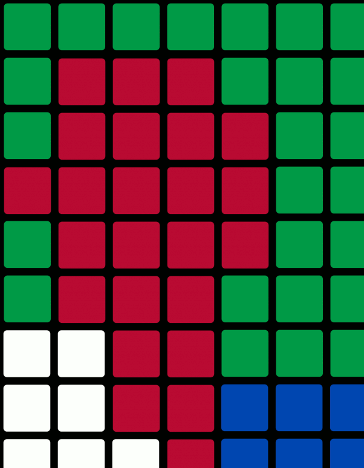

# Invaders-Creator

En tant que fan du Jeu [Space Invaders](https://fr.wikipedia.org/wiki/Space_Invaders) et de l'artiste [Invader](https://space-invaders.com/home/) je ne pouvais que moi-même m'y mettre

Voici mon projet :
* Créer des *Invaders* en partant d'une moitié gauche par pixels aléatoires et en reproduisant la partie droite par symétrie  
Il devrait y avoir de nombreuses évolutions à cette partie du projet.
* Transformer une image en pixel art avec des Rubik's Cube comme le fait si bien [Invader](https://www.francetvinfo.fr/culture/arts-expos/street-art/la-joconde-en-rubik-s-cube-de-l-artiste-urbain-invader-s-envole-a-480-000-euros-aux-encheres_3839189.html)

Voici ma trombine en Rubik's Cube : 

* ... à suivre
